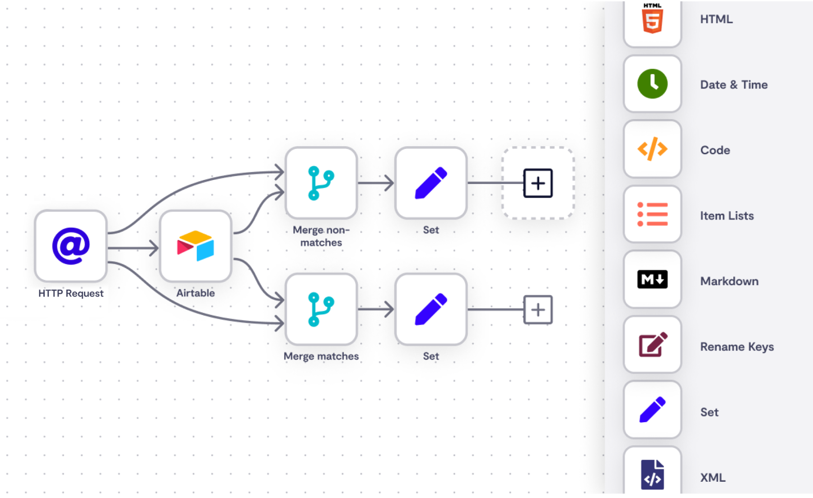
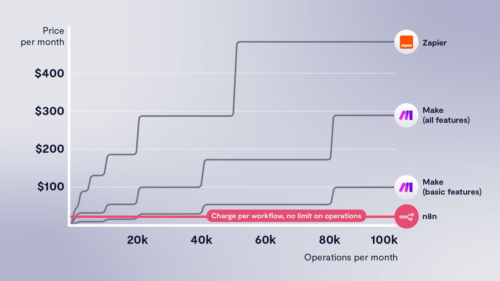

# Episodio 1: Introducción a n8n y comparativa con Zapier y Make

## ¿Qué es automatizar?

La automatización de procesos consiste en utilizar tecnología para ejecutar tareas repetitivas sin intervención humana. En el contexto digital, esto significa crear flujos de trabajo que conecten diferentes aplicaciones y servicios para que trabajen juntos de forma automática, ahorrando tiempo, reduciendo errores y permitiendo a las personas centrarse en tareas de mayor valor.

Algunos ejemplos comunes de automatización incluyen:
- Enviar correos electrónicos automáticos cuando se recibe un nuevo formulario
- Sincronizar datos entre diferentes plataformas
- Publicar contenido en redes sociales según un calendario
- Procesar y analizar datos automáticamente
- Generar informes periódicos sin intervención manual

## ¿Qué es n8n?

n8n es una herramienta de automatización de flujos de trabajo opensource que permite conectar diferentes servicios y aplicaciones. Su nombre deriva de "node" (nodo) y el infinito (∞), simbolizando posibilidades infinitas de automatización.

Características principales de n8n:
- **Código abierto**: Puedes ver, modificar y ejecutar el código según tus necesidades
- **Self-hosted**: Puedes instalarlo en tu propio servidor o localmente, manteniendo el control total de tus datos
- **Interfaz visual**: Diseño de flujos de trabajo mediante una interfaz gráfica intuitiva
- **Extensible**: Posibilidad de crear nodos personalizados para conectar con cualquier servicio
- **Fair-code**: Modelo de licencia que equilibra el código abierto con la sostenibilidad comercial

n8n utiliza un sistema basado en nodos, donde cada nodo representa una acción o servicio específico. Estos nodos se conectan entre sí para crear flujos de trabajo complejos que automatizan procesos empresariales o personales.

## Razones para usar n8n sobre Zapier o Make

### 1. Control total sobre tus datos

Al ser una solución self-hosted, n8n te permite mantener todos tus datos y flujos de trabajo en tu propia infraestructura. Esto es especialmente importante para empresas con requisitos estrictos de privacidad o que manejan datos sensibles.

### 2. Sin límites de ejecuciones

A diferencia de otras plataformas que cobran por volumen de ejecuciones, con n8n puedes ejecutar tus flujos de trabajo tantas veces como necesites sin costos adicionales (solo pagas por tu propia infraestructura).

### 3. Más barato

Tanto si decides hostearlo por tu propia cuenta como dejar que lo hosteen desde la web de n8n, es más barato que Zapier o Make, sienco mucho más barato si lo self-hosteamos y más barato si usamos su servicio de cloud, ya que pagamos por ejecuciones de workflow no por ejecuciones de nodo individuales como en Make o Zapier.

### 4. Personalización avanzada

n8n permite un nivel de personalización que otras plataformas no ofrecen:
- Creación de nodos personalizados
- Modificación del código fuente según tus necesidades
- Integración con prácticamente cualquier API o servicio

### 5. Comunidad activa y evolución más rápida

Al ser un proyecto de código abierto, n8n cuenta con una comunidad activa de desarrolladores que constantemente mejoran la plataforma y crean nuevas integraciones.

## Conclusión

n8n representa una alternativa poderosa y flexible a las plataformas tradicionales de automatización como Make y Zapier. Si valoras el control sobre tus datos, la personalización avanzada y un modelo de costos predecible, n8n ofrece ventajas significativas.

En este curso, exploraremos a fondo n8n para aprovechar al máximo su potencial y crear automatizaciones sofisticadas que impulsen la eficiencia de tus procesos.

## Recursos

- [Sitio oficial de n8n](https://n8n.io/)
- [Documentación de n8n](https://docs.n8n.io/)
- [Repositorio de GitHub de n8n](https://github.com/n8n-io/n8n)
- [Comparativa detallada: n8n vs Zapier](https://n8n.io/blog/why-i-chose-n8n-over-zapier/) 