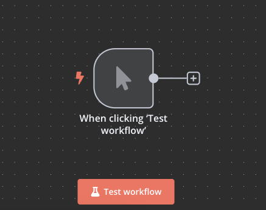

# Desafío 3: Creación de un workflow básico

## Objetivo

Crear tu primer workflow con un trigger manual y ejecutarlo utilizando el botón de Test Workflow.

## Contexto

El punto de partida de cualquier automatización en n8n es un trigger. El trigger manual es el más sencillo de todos, ya que permite iniciar un workflow con un simple clic. En este desafío, crearás un workflow con un trigger manual y aprenderás a ejecutarlo.

## Requisitos

- n8n instalado y funcionando

## El desafío

1. **Crear un nuevo workflow**
   - Crea un nuevo workflow y nómbralo "Mi primer workflow"

2. **Añadir un trigger manual**
   - Añade un nodo "Manual Trigger" al canvas
   - No es necesario configurar nada en este nodo

3. **Ejecutar el workflow**
   - Localiza el botón "Test Workflow" en la parte superior del canvas
   - Haz clic en el botón para ejecutar el workflow
   - Observa cómo el nodo cambia de color al ejecutarse
   - Haz clic en el nodo para ver los datos de salida

