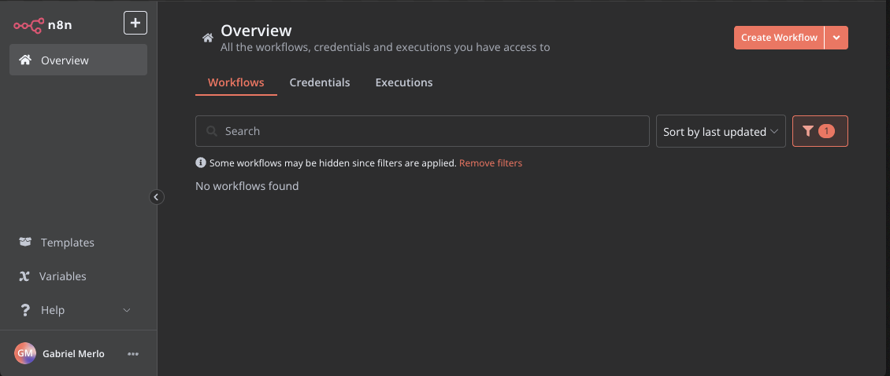
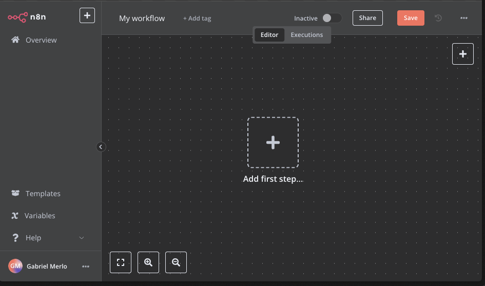

# Episodio 3: Introducción a la interfaz de usuario de n8n

## Contenido del episodio
- [¿Qué es un workflow?](#qué-es-un-workflow)
- [Interfaz principal de n8n](#interfaz-principal-de-n8n)
  - [Menú lateral izquierdo](#menú-lateral-izquierdo)
  - [Vista de workflows](#vista-de-workflows)
  - [Filtros y búsqueda](#filtros-y-búsqueda)
- [Interfaz del editor de workflows](#interfaz-del-editor-de-workflows)
  - [Barra superior](#barra-superior)
  - [Canvas de trabajo](#canvas-de-trabajo)
  - [Controles de teclado y navegación](#controles-de-teclado-y-navegación)
- [Elementos de un workflow](#elementos-de-un-workflow)
  - [¿Qué son los nodos?](#qué-son-los-nodos)
  - [Conexión entre nodos](#conexión-entre-nodos)
  - [Flujo de datos entre nodos](#flujo-de-datos-entre-nodos)
- [Interacción con nodos](#interacción-con-nodos)
  - [Menú contextual (click derecho)](#menú-contextual-click-derecho)
  - [Opciones al hacer hover](#opciones-al-hacer-hover)
- [Conceptos importantes](#conceptos-importantes)
  - [¿Qué son las credenciales?](#qué-son-las-credenciales)
  - [¿Qué son las executions?](#qué-son-las-executions)
  - [¿Qué es JSON?](#qué-es-json)
- [Prueba de workflows](#prueba-de-workflows)
  - [Test workflow](#test-workflow)
  - [Visualización de resultados](#visualización-de-resultados)

## ¿Qué es un workflow?

Un workflow (flujo de trabajo) en n8n esUn workflow es el espacio en el que conectamos nodos entre sí para automatizar un proceso. Cada workflow está compuesto por nodos interconectados que representan diferentes operaciones, desde la obtención de datos hasta su procesamiento y envío a otros servicios.

Los workflows en n8n permiten automatizar tareas repetitivas, conectar diferentes aplicaciones y servicios, y procesar datos de manera eficiente sin necesidad de escribir código complejo.

## Interfaz principal de n8n

La interfaz principal de n8n es donde gestionas todos tus workflows, credenciales y ejecuciones.



### Menú lateral izquierdo

El menú lateral izquierdo proporciona acceso a las principales secciones de n8n:

- **Overview**: Muestra todos los workflows, credenciales y ejecuciones a los que tienes acceso
- **Templates**: Acceso a plantillas predefinidas de workflows
- **Variables**: Gestión de variables globales que pueden ser utilizadas en tus workflows
- **Help**: Acceso a la documentación y recursos de ayuda

### Vista de workflows

En la vista principal (Overview), puedes ver:

- Lista de todos tus workflows con información sobre:
  - Nombre del workflow
  - Última actualización
  - Fecha de creación
  - Estado (activo/inactivo)
  - Tipo (personal/compartido)
- Botón "Create Workflow" para crear nuevos workflows
- Pestañas para alternar entre Workflows, Credentials y Executions

### Filtros y búsqueda

La interfaz principal incluye herramientas para gestionar tus workflows:

- Barra de búsqueda para encontrar workflows específicos
- Filtros para ordenar workflows (por fecha de actualización, nombre, etc.)
- Opciones para activar/desactivar workflows
- Menú de opciones (tres puntos verticales) para cada workflow

## Interfaz del editor de workflows

Al crear un nuevo workflow o editar uno existente, accedes al editor de workflows, que es donde construyes y configuras tus automatizaciones.



### Barra superior

La barra superior del editor contiene:

- Nombre del workflow (editable)
- Botón para añadir etiquetas
- Interruptor para activar/desactivar el workflow
- Botón "Share" para compartir el workflow
- Botón "Save" para guardar cambios
- Pestañas "Editor" y "Executions" para alternar entre la edición y el historial de ejecuciones

### Canvas de trabajo

El canvas es el área principal donde diseñas tu workflow:

- Fondo cuadriculado donde se colocan y conectan los nodos
- Botón central "Add first step..." para comenzar un nuevo workflow
- Botón "+" en la esquina superior derecha para añadir nodos
- Área de trabajo donde puedes arrastrar, soltar y conectar nodos

### Controles de teclado y navegación

Para facilitar el trabajo en el canvas, puedes utilizar:

- **Zoom**: Rueda del ratón o Ctrl/Cmd + "+"/"-"
- **Mover el canvas**: Mantener pulsado el botón central del ratón o barra espaciadora + arrastrar
- **Selección múltiple**: Ctrl/Cmd + arrastrar para seleccionar varios nodos
- **Copiar/Pegar nodos**: Ctrl/Cmd + C / Ctrl/Cmd + V
- **Eliminar nodos**: Tecla Supr o Backspace

## Elementos de un workflow

### ¿Qué son los nodos?

Los nodos son los bloques de construcción fundamentales de cualquier workflow en n8n:

- Cada nodo representa una acción, operación o integración específica
- Existen diferentes tipos de nodos:
  - **Trigger nodes**: Inician el workflow (Manual trigger, Webhook, Schedule, etc.)
  - **Action nodes**: Tienen la capacidad de alterar el array de objetos JSON del flujo

### Conexión entre nodos

Los nodos se conectan entre sí para formar un flujo de trabajo:

- Las conexiones se representan como líneas que unen los nodos
- Para conectar dos nodos:
  1. Haz clic en el punto de salida de un nodo (a la derecha)
  2. Arrastra hasta el punto de entrada del siguiente nodo (a la izquierda)
  3. Suelta para crear la conexión
- También puedes hacer clic en el botón "+" que aparece después de un nodo para añadir y conectar automáticamente un nuevo nodo

### Flujo de datos entre nodos

Los datos fluyen de un nodo a otro a través de las conexiones:

- Cada nodo recibe datos, los procesa y envía el resultado al siguiente nodo
- Los datos se transmiten en formato JSON
- Puedes ver los datos que fluyen entre nodos durante la ejecución haciendo clic en un nodo

## Interacción con nodos

### Menú contextual (click derecho)

Al hacer clic derecho sobre un nodo, aparece un menú contextual con opciones como:

- **Execute node**: Ejecuta solo ese nodo y los anteriores
- **Copy/Paste**: Copiar o pegar nodos
- **Duplicate**: Duplicar el nodo
- **Delete**: Eliminar el nodo
- **Rename**: Cambiar el nombre del nodo
- **Disable/Enable**: Desactivar o activar el nodo

### Opciones al hacer hover

Al pasar el cursor sobre un nodo, aparecen opciones rápidas:

- **Ejecutar hasta este nodo**: Icono de play
- **Desactivar/Activar este nodo**: Icono de encendido/apagado
- **Más opciones**: Tres puntos verticales (abre el menú contextual)

## Conceptos importantes

### ¿Qué son las credenciales?

Las credenciales en n8n son información de autenticación segura que permite conectar con servicios externos:

- Se almacenan de forma segura y encriptada
- Se pueden reutilizar en diferentes workflows
- Incluyen tokens de API, nombres de usuario, contraseñas, etc.
- Se gestionan desde la pestaña "Credentials" en la vista principal

### ¿Qué son las executions?

Las executions (ejecuciones) son instancias específicas de un workflow que se ha ejecutado:

- Cada vez que se ejecuta un workflow, se crea un registro de ejecución
- Las ejecuciones almacenan:
  - Fecha y hora de la ejecución
  - Estado (exitoso, fallido, etc.)
  - Datos procesados en cada nodo
  - Errores (si los hubo)
- Se pueden ver desde la pestaña "Executions" tanto en la vista principal como en el editor de workflows

### ¿Qué es JSON?

JSON (JavaScript Object Notation) es el formato de datos principal utilizado en n8n:

- Es un formato ligero de intercambio de datos
- Utiliza una estructura de pares clave-valor
- Ejemplo:
  ```json
  {
    "nombre": "Juan",
    "edad": 30,
    "correo": "juan@ejemplo.com"
  }
  ```
- En n8n, los datos fluyen entre nodos en formato JSON
- Muchas configuraciones de nodos requieren entender y manipular JSON

## Prueba de workflows

### Test workflow

Para probar un workflow:

1. Haz clic en el botón "Test Workflow" en la zona inferior de tu workflow
2. Observa cómo los nodos cambian de color a medida que se ejecutan:
   - Verde: Ejecución exitosa
   - Rojo: Error en la ejecución
   - Gris: Nodo no ejecutado

### Visualización de resultados

Para ver los resultados de la ejecución:

1. Haz clic en cualquier nodo después de la ejecución
2. Se abrirá un panel que muestra:
   - Input: Datos que recibió el nodo
   - Output: Datos que generó el nodo
   - Opciones para ver los datos en diferentes formatos (JSON, Table, etc.)

Esta visualización es crucial para depurar workflows y entender cómo fluyen los datos entre nodos.

## Recursos

- [Documentación oficial de n8n](https://docs.n8n.io/)
- [Guía de nodos en n8n](https://docs.n8n.io/integrations/)
