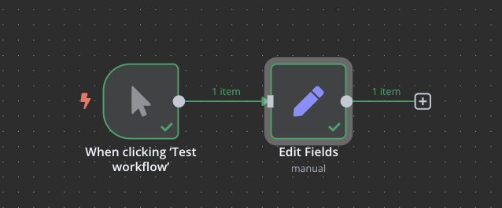

# Desafío del Episodio 4

## Contenido
- [Descripción del desafío](#descripción-del-desafío)
- [Objetivos](#objetivos)
- [Extensión del desafío (opcional)](#extensión-del-desafío-opcional)
- [Recursos adicionales](#recursos-adicionales)

## Descripción del desafío

En este desafío, crearás tu primer workflow para generar datos artificiales utilizando los conceptos básicos aprendidos sobre nodos y flujo de datos en n8n.

## Objetivos

Tu workflow debe cumplir con los siguientes objetivos:

1. Utilizar un nodo "Manual Trigger" como punto de inicio del workflow
2. Conectar un nodo "Set" para crear un objeto JSON con:
   - Un campo para tu nombre
   - Un campo para tu apellido
3. Ejecutar el workflow y visualizar el resultado en diferentes formatos:
   - Vista JSON
   - Vista Table
   - Vista Schema

## Extensión del desafío (opcional)

Si quieres llevar este desafío un paso más allá, puedes:

1. Añadir un segundo nodo "Set" que combine el nombre y apellido en un campo "nombreCompleto" utilizando el modo Expression
2. Añadir campos adicionales como "edad", "ciudad" o "profesión"
3. Experimentar con diferentes tipos de datos (Number, Boolean, Array, Object)

## Recursos adicionales

- [Documentación del nodo Set](https://docs.n8n.io/integrations/builtin/core-nodes/n8n-nodes-base.set/)
- [Guía de expresiones en n8n](https://docs.n8n.io/code-examples/expressions/)
- [Guía de JSON](https://www.json.org/json-es.html) 
