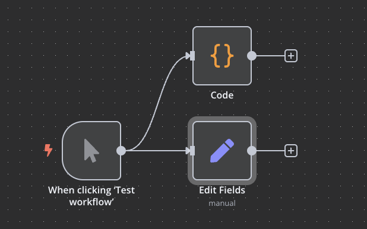

# Episodio 4: Conceptos Fundamentales y Fundamentos de Construcción n8n

## Contenido del episodio
- [Ejemplo básico: Trigger Manual y nodo Set](#ejemplo-básico-trigger-manual-y-nodo-set)
- [Funcionamiento interno de n8n](#funcionamiento-interno-de-n8n)
  - [Arquitectura y lenguaje de programación](#arquitectura-y-lenguaje-de-programación)
  - [Mecanismo de flujo de datos JSON](#mecanismo-de-flujo-de-datos-json)
- [Flujo de datos en workflows](#flujo-de-datos-en-workflows)
  - [Creación de múltiples ramas](#creación-de-múltiples-ramas)
  - [Transporte de datos entre nodos](#transporte-de-datos-entre-nodos)
- [Variables en n8n](#variables-en-n8n)
  - [Tipos de variables](#tipos-de-variables)
  - [Visualización de variables](#visualización-de-variables)
- [Configuración de parámetros](#configuración-de-parámetros)
  - [Modo Fixed vs Expression](#modo-fixed-vs-expression)
  - [Uso de expresiones](#uso-de-expresiones)
- [Ejemplo práctico](#ejemplo-práctico)
- [Desafío de la parte 4](#desafío-de-la-parte-4)

## Ejemplo básico: Trigger Manual y nodo Set

Para comenzar a entender los conceptos fundamentales de n8n, vamos a crear un ejemplo básico utilizando dos nodos esenciales:

1. **Manual Trigger**: Este nodo inicia el workflow cuando hacemos clic en "Test Workflow".
2. **Set**: Este nodo nos permite definir datos que se utilizarán en el workflow.

Para crear este ejemplo:

1. Crea un nuevo workflow
2. Añade un nodo "Manual Trigger"
3. Añade un nodo "Set" conectado al trigger
4. En el nodo "Set", configura un valor simple:
   - Name: `mensaje`
   - Type: `String`
   - Value: `¡Hola desde n8n!`

Al ejecutar este workflow, el nodo "Set" generará un objeto JSON con el mensaje que hemos definido.

## Funcionamiento interno de n8n

### Arquitectura y lenguaje de programación

n8n está construido principalmente con TypeScript, un superconjunto tipado de JavaScript. Esta elección tecnológica influye significativamente en cómo funciona la plataforma:

- **TypeScript**: Proporciona tipado estático, lo que hace que el código sea más robusto y facilita el desarrollo de una plataforma compleja.
- **Node.js**: n8n se ejecuta sobre Node.js, lo que le permite aprovechar el ecosistema de npm y su modelo de ejecución asíncrona.
- **Vue.js**: La interfaz de usuario está construida con Vue.js, proporcionando una experiencia interactiva y reactiva.

Esta arquitectura permite que n8n sea:
- Extensible: Fácil de añadir nuevos nodos e integraciones
- Portable: Puede ejecutarse en diferentes entornos
- Eficiente: Capaz de manejar operaciones asíncronas de manera efectiva

### Mecanismo de flujo de datos JSON

El corazón del funcionamiento de n8n es su sistema de flujo de datos basado en JSON:

- **Array de objetos JSON**: Todos los datos en n8n fluyen como arrays de objetos JSON.
- **Procesamiento por lotes**: Cada elemento del array se procesa individualmente, permitiendo operaciones en paralelo.
- **Transformación de datos**: Cada nodo recibe el array, lo procesa y pasa el resultado al siguiente nodo.

Por ejemplo, si tenemos un array con dos objetos:

```json
[
  { "nombre": "Ana", "edad": 28 },
  { "nombre": "Carlos", "edad": 35 }
]
```

Cada nodo procesará ambos objetos según su configuración, manteniendo la estructura de array.

## Flujo de datos en workflows

### Creación de múltiples ramas

Una característica poderosa de n8n es la capacidad de crear múltiples ramas de ejecución a partir de un nodo:

1. **Bifurcación simple**: Conectar un nodo a varios nodos siguientes
   - Los mismos datos se envían a todos los nodos conectados
   - Cada rama procesa los datos de forma independiente

2. **Bifurcación condicional**: Usando nodos como "IF" o "Switch"
   - Los datos se dirigen a diferentes ramas según condiciones
   - Permite crear flujos de trabajo complejos con lógica de negocio



### Transporte de datos entre nodos

Los datos se transportan entre nodos siguiendo estas reglas:

1. **Formato consistente**: Siempre como arrays de objetos JSON
2. **Preservación de estructura**: La estructura de array se mantiene
3. **Enriquecimiento progresivo**: Cada nodo puede añadir, modificar o eliminar propiedades
4. **Referencias a datos anteriores**: Un nodo puede acceder a los datos generados por nodos previos gracias al Schema

## Variables en n8n

### Tipos de variables

En n8n existen diferentes tipos de variables:

1. **Variables de nodo**: Datos generados por un nodo específico
   - Accesibles mediante `$node["NombreNodo"].data`

2. **Variables globales**: Disponibles en todo el workflow
   - Configuradas en la sección "Variables" de n8n
   - Accesibles mediante `$vars`


### Visualización de variables

n8n ofrece diferentes formas de visualizar los datos:

1. **Vista JSON**: Muestra la estructura completa de los datos en formato JSON
2. **Vista Table**: Presenta los datos en formato de tabla para facilitar su lectura
3. **Vista Schema**: Muestra el esquema de los datos (tipos y estructura)

Para acceder a estas vistas:
1. Ejecuta el workflow
2. Haz clic en un nodo
3. En el panel que se abre, selecciona la pestaña "Output"
4. Elige entre las diferentes vistas disponibles

## Configuración de parámetros

### Modo Fixed vs Expression

Al configurar parámetros en los nodos de n8n, existen dos modos principales:

1. **Fixed (Fijo)**: 
   - Valores estáticos que no cambian
   - Se introducen directamente en el campo
   - Útil para valores constantes

2. **Expression (Expresión)**:
   - Valores dinámicos que pueden incluir variables y lógica
   - Se escriben entre corchetes dobles `{{ }}`
   - Permiten operaciones y acceso a datos de otros nodos

Para cambiar entre estos modos:
1. Haz clic en el botón de edición (icono de lápiz) junto al campo
2. Selecciona "Expression" para usar expresiones o "Fixed" para valores estáticos

### Uso de expresiones

Las expresiones en n8n permiten:

1. **Acceder a datos de otros nodos**: 
   ```
   {{ $node["Set"].data.nombre }}
   ```

2. **Realizar operaciones**:
   ```
   {{ $input.item.precio * 1.21 }}
   ```

3. **Usar funciones de JavaScript**:
   ```
   {{ $input.item.texto.toUpperCase() }}
   ```

4. **Aplicar lógica condicional**:
   ```
   {{ $input.item.edad > 18 ? "Adulto" : "Menor" }}
   ```

## Ejemplo práctico

Vamos a crear un ejemplo que demuestre los conceptos aprendidos:

1. Añade un nodo "Manual Trigger"
2. Conecta un nodo "Set" y configúralo para crear datos personales:
   - Name: `persona`
   - Type: `Object`
   - Value (en modo Expression): 
     ```json
     {
       "nombre": "Ana",
       "apellido": "García",
       "edad": 28,
       "ciudad": "Madrid"
     }
     ```

3. Añade otro nodo "Set" conectado al anterior y configúralo para añadir información:
   - Name: `nombreCompleto`
   - Type: `String`
   - Value (en modo Expression): `{{ $json.nombre + " " + $json.apellido }}`
   
   - Name: `esMayorEdad`
   - Type: `Boolean`
   - Value (en modo Expression): `{{ $json.edad >= 18 }}`

4. Ejecuta el workflow y observa cómo los datos fluyen y se transforman entre los nodos

Este ejemplo muestra:
- Creación de datos estructurados
- Uso de expresiones para manipular datos
- Flujo de información entre nodos
- Transformación progresiva de los datos

## Desafío de la parte 4

Para poner en práctica lo aprendido, te proponemos el siguiente desafío:

Crea un workflow con un "Manual Trigger" y un nodo "Set" para generar tu primer dato artificial: un objeto con tu nombre y apellido.

Consulta el [desafío completo aquí](desafio-episodio-4.md). 