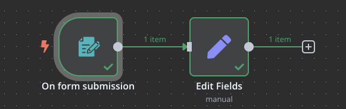

# Desafío del Episodio 5

## Contenido
- [Descripción del desafío](#descripción-del-desafío)
- [Objetivos](#objetivos)
- [Recursos adicionales](#recursos-adicionales)

## Descripción del desafío

En este desafío, crearás un workflow que utilice un trigger de formulario para recoger información de contacto y procesarla. Deberás aplicar los conceptos aprendidos sobre triggers y manipulación de datos básica.

## Objetivos

Tu workflow debe cumplir con los siguientes objetivos:

1. Crear un formulario atractivo utilizando el nodo "Form Trigger" que recoja:
   - Nombre del usuario
   - Apellido del usuario
   - Correo electrónico
   
2. Procesar los datos recibidos para:
   - Combinar el nombre y apellido en un nuevo campo llamado "nombre_y_apellido"
   
3. Mostrar al usuario un mensaje de confirmación después de enviar el formulario

4. Personalizar la apariencia del formulario para hacerlo más atractivo (remover el símbolo de n8n, botón en español, descripción, etc.)

## Recursos adicionales

- [Documentación del nodo Form Trigger](https://docs.n8n.io/integrations/builtin/core-nodes/n8n-nodes-base.formtrigger/)
- [Documentación del nodo Set](https://docs.n8n.io/integrations/builtin/core-nodes/n8n-nodes-base.set/)
