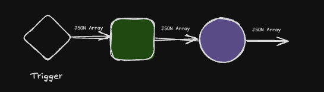

# Episodio 5: Profundizando en los Triggers

## Contenido del episodio
- [Introducción a los Triggers](#introducción-a-los-triggers)
- [Tipos de Triggers en n8n](#tipos-de-triggers-en-n8n)
  - [Triggers manuales](#triggers-manuales)
  - [Triggers programados](#triggers-programados)
  - [Triggers basados en eventos](#triggers-basados-en-eventos)
  - [Triggers de webhook](#triggers-de-webhook)
- [Conceptos fundamentales](#conceptos-fundamentales)
  - [¿Qué es una HTTP Request?](#qué-es-una-http-request)
  - [Entendiendo las APIs](#entendiendo-las-apis)
  - [Webhooks explicados](#webhooks-explicados)
- [Desafío de la parte 5](#desafío-de-la-parte-5)

## Introducción a los Triggers

Los triggers son el punto de partida de cualquier workflow en n8n. Son los elementos que inician la ejecución de un flujo de trabajo, ya sea manualmente, en un momento programado, o en respuesta a un evento externo.

Entender los diferentes tipos de triggers y cómo funcionan es fundamental para crear workflows efectivos y automatizados en n8n.



## Tipos de Triggers en n8n

### Triggers manuales

El trigger más básico es el **Manual Trigger**, que ya hemos utilizado en episodios anteriores. Este trigger inicia el workflow cuando hacemos clic en el botón "Test Workflow".

**Características principales:**
- Ejecución bajo demanda
- No requiere configuración adicional
- Útil para pruebas y workflows que se ejecutan ocasionalmente
- Puede aceptar datos de entrada manualmente


### Triggers programados

Los triggers programados (**Schedule Trigger**) permiten ejecutar workflows en momentos específicos o con una frecuencia determinada.

**Características principales:**
- Ejecución automática según un horario definido
- Permite definir intervalos (cada hora, día, semana, etc.)
- Puede configurarse para ejecutarse en zonas horarias específicas

**Ejemplo de configuración:**
- Cada día a las 9:00 AM
- Cada lunes a medianoche
- Cada 15 minutos

**Ejemplo de uso:** Un workflow para hacer copias de seguridad diarias o enviar informes semanales.

### Triggers basados en eventos

Estos triggers inician workflows cuando ocurre un evento específico en un servicio o aplicación integrada.

**Ejemplos populares:**
- **Gmail Trigger**: Se activa cuando llega un nuevo correo
- **Telegram Trigger**: Se activa cuando se recibe un mensaje
- **Google Sheets Trigger**: Se activa cuando se añade o modifica una fila
- **Slack Trigger**: Se activa cuando se publica un mensaje en un canal

**Características principales:**
- Conexión directa con servicios externos
- Requieren autenticación con el servicio correspondiente
- Pueden filtrar eventos según criterios específicos
- Proporcionan los datos del evento para su procesamiento

### Triggers de webhook

Los webhooks son uno de los tipos de triggers más versátiles y potentes en n8n. Permiten que servicios externos envíen datos a tu workflow mediante solicitudes HTTP.

**Características principales:**
- Generan una URL única para recibir datos
- Soportan diferentes métodos HTTP (GET, POST, PUT, etc.)
- Pueden configurarse para responder con datos personalizados

**Ejemplo de uso:** Un workflow que procesa pagos online o formularios de contacto de un sitio web.

## Conceptos fundamentales

### ¿Qué es una HTTP Request?

Una **HTTP Request** (solicitud HTTP) es un mensaje enviado por un cliente a un servidor siguiendo el protocolo HTTP (Hypertext Transfer Protocol), que es la base de la comunicación en la web.

**Componentes principales de una solicitud HTTP:**

1. **Método HTTP**: Indica la acción a realizar
   - **GET**: Solicitar datos (como cargar una página web)
   - **POST**: Enviar datos (como un formulario)
   - **PUT**: Actualizar datos existentes
   - **DELETE**: Eliminar datos
   - Otros: PATCH, HEAD, OPTIONS, etc.

2. **URL**: La dirección del recurso al que se accede
   - Ejemplo: `https://api.ejemplo.com/usuarios/123`

3. **Headers**: Metadatos sobre la solicitud
   - Content-Type: Tipo de contenido enviado
   - Authorization: Credenciales para autenticación
   - User-Agent: Información sobre el cliente

4. **Body**: Datos enviados con la solicitud (principalmente en POST, PUT)
   - Puede contener JSON, form-data, texto plano, etc.

**Ejemplo simplificado:**
```
POST /api/usuarios HTTP/1.1
Host: ejemplo.com
Content-Type: application/json

{
  "nombre": "Ana",
  "email": "ana@ejemplo.com"
}
```

### Entendiendo las APIs

Una **API** (Application Programming Interface) es un conjunto de reglas y protocolos que permite que diferentes aplicaciones se comuniquen entre sí.

**Características de las APIs modernas:**

1. **APIs REST**: El tipo más común de API web
   - Utilizan métodos HTTP estándar (GET, POST, PUT, DELETE)
   - Operan sobre recursos identificados por URLs
   - Devuelven respuestas en formatos como JSON o XML
   - Son stateless (sin estado): cada solicitud contiene toda la información necesaria

2. **Endpoints**: Puntos de acceso específicos de una API
   - Ejemplo: `/usuarios`, `/productos/123`, `/pedidos`
   - Cada endpoint realiza operaciones específicas sobre un recurso

3. **Autenticación**: Mecanismos para verificar la identidad
   - API Keys: Claves únicas para identificar al cliente
   - OAuth: Protocolo de autorización para acceso seguro
   - JWT (JSON Web Tokens): Tokens firmados para autenticación

4. **Respuestas**: Datos devueltos por la API
   - Códigos de estado HTTP (200 OK, 404 Not Found, 500 Error, etc.)
   - Datos estructurados (generalmente JSON)
   - Mensajes de error o éxito

**Ejemplo de interacción con una API:**
1. Cliente envía: `GET https://api.ejemplo.com/usuarios/123`
2. Servidor responde:
```json
{
  "id": 123,
  "nombre": "Ana García",
  "email": "ana@ejemplo.com",
  "rol": "administrador"
}
```

### Webhooks explicados

Un **webhook** es un mecanismo que permite a una aplicación proporcionar información en tiempo real a otras aplicaciones cuando ocurre un evento específico.

**Diferencia clave entre API y webhook:**
- **API**: El cliente solicita datos al servidor (pull)
- **Webhook**: El servidor envía datos al cliente cuando ocurre un evento (push)

**Funcionamiento de los webhooks:**

1. **Registro**: Una aplicación A se registra con la aplicación B proporcionando una URL de callback
2. **Evento**: Cuando ocurre un evento en la aplicación B
3. **Notificación**: La aplicación B envía una solicitud HTTP (generalmente POST) a la URL registrada
4. **Procesamiento**: La aplicación A recibe los datos y los procesa

**Ventajas de los webhooks:**
- Comunicación en tiempo real
- Reducción de consultas innecesarias (polling)
- Eficiencia en recursos
- Arquitecturas orientadas a eventos

**Ejemplos comunes de webhooks:**
- Notificaciones de pago (Stripe, PayPal)
- Actualizaciones de repositorios (GitHub, GitLab)
- Eventos de CRM (HubSpot, Salesforce)
- Mensajes de chat (Slack, Discord)


## Desafío de la parte 5

Para poner en práctica lo aprendido sobre triggers, te proponemos el siguiente desafío:

Crea un workflow que use un trigger de "Form" para recibir datos de un formulario simple. Configura el formulario para recoger información de nombre, apellido y correo electrónico. Luego, utiliza un nodo Set para combinar el nombre y apellido en un nuevo valor llamado "nombre_y_apellido". Personaliza el formulario como desees para hacerlo más atractivo.

Consulta el [desafío completo aquí](desafio-episodio-5.md) 