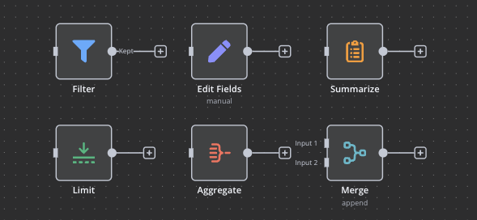
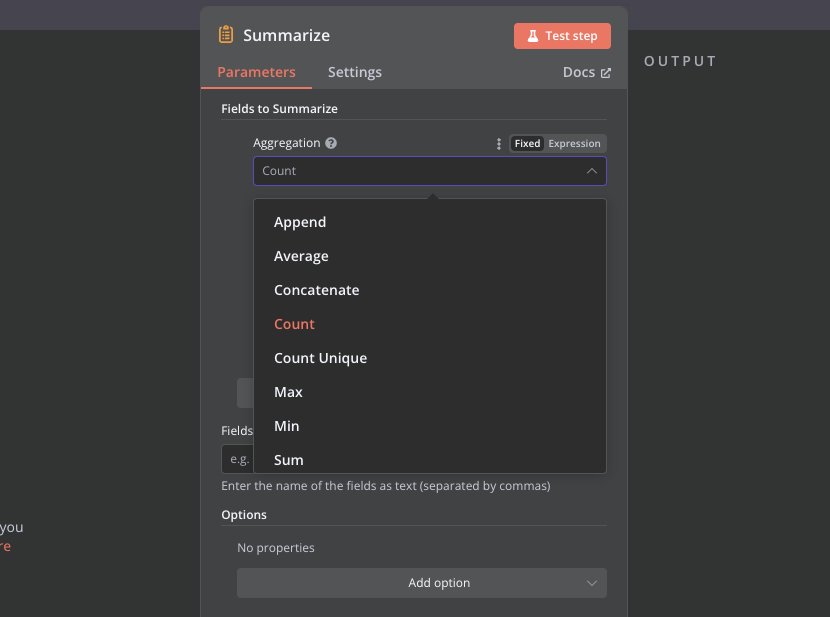

# Episodio 6: Trabajando con Nodos de Datos en n8n

## Contenido del episodio
- [Introducción a los nodos de datos](#introducción-a-los-nodos-de-datos)
- [Tipos de nodos de datos en n8n](#tipos-de-nodos-de-datos-en-n8n)
  - [Nodos de manipulación de datos](#nodos-de-manipulación-de-datos)
  - [Nodos de transformación](#nodos-de-transformación)
  - [Nodos de filtrado](#nodos-de-filtrado)
  - [Nodos de agregación](#nodos-de-agregación)
- [Tipos de datos fundamentales](#tipos-de-datos-fundamentales)
  - [String (Cadena de texto)](#string-cadena-de-texto)
  - [Number (Número)](#number-número)
  - [Boolean (Booleano)](#boolean-booleano)
  - [Array (Arreglo)](#array-arreglo)
  - [Object (Objeto)](#object-objeto)
- [Trabajando con el nodo Summarize](#trabajando-con-el-nodo-summarize)
  - [Funciones de agregación](#funciones-de-agregación)
- [Procesamiento de archivos CSV](#procesamiento-de-archivos-csv)
  - [Recibiendo archivos CSV mediante formularios](#recibiendo-archivos-csv-mediante-formularios)
  - [Procesando datos CSV](#procesando-datos-csv)
- [Desafío de la parte 6](#desafío-de-la-parte-6)

## Introducción a los nodos de datos

Los nodos de datos en n8n son componentes fundamentales que permiten manipular, transformar y analizar información dentro de los workflows. Estos nodos son esenciales para convertir datos de un formato a otro, filtrar información no deseada, combinar datos de diferentes fuentes y realizar cálculos o agregaciones.

En este episodio, exploraremos los diferentes tipos de nodos de datos disponibles en n8n y aprenderemos cómo utilizarlos para resolver problemas comunes de procesamiento de información.



## Tipos de nodos de datos en n8n

### Nodos de manipulación de datos

Estos nodos permiten modificar la estructura y el contenido de los datos:

1. **Set**: El nodo más versátil para crear o modificar datos. Permite:
   - Crear nuevos campos
   - Modificar valores existentes
   - Eliminar campos no deseados
   - Combinar valores de diferentes campos

2. **Extract from file**: Permite mover datos binarios (como archivos) entre diferentes propiedades.

3. **Rename Keys**: Cambia los nombres de las propiedades en los objetos JSON, útil para adaptar datos entre diferentes sistemas.

4. **Split Out**: Convierte un array en múltiples elementos individuales, permitiendo procesar cada elemento por separado.

### Nodos de transformación

Estos nodos convierten datos de un formato a otro:

1. **HTML**: Trabaja con contenido HTML, permitiendo:
   - Extraer datos de páginas web
   - Generar contenido HTML a partir de datos

2. **XML**: Convierte entre XML y JSON, facilitando la integración con sistemas que utilizan XML.

3. **Markdown**: Convierte entre Markdown y HTML, útil para generar contenido para blogs o documentación.

### Nodos de filtrado

Estos nodos permiten seleccionar qué datos procesar:

1. **Filter**: Elimina elementos que no cumplen con una condición específica.

2. **Limit**: Restringe el número de elementos a procesar, útil para trabajar con grandes conjuntos de datos.

3. **Remove Duplicates**: Elimina elementos duplicados basándose en valores de campos específicos.

### Nodos de agregación

Estos nodos combinan múltiples elementos en uno solo:

1. **Aggregate**: Combina valores de múltiples elementos en una lista dentro de un solo elemento.

2. **Merge**: Une datos de múltiples ramas de un workflow cuando todos los datos están disponibles.

3. **Summarize**: Realiza cálculos estadísticos como sumas, promedios, conteos, etc., sobre conjuntos de datos.

## Tipos de datos fundamentales

Para trabajar eficientemente con los nodos de datos, es importante entender los tipos de datos básicos en n8n:

### String (Cadena de texto)

Las cadenas de texto son secuencias de caracteres utilizadas para representar texto.

**Características**:
- Se escriben entre comillas: `"Hola mundo"`
- Pueden contener letras, números, símbolos y espacios
- Tienen métodos útiles como `toUpperCase()`, `toLowerCase()`, `trim()`, etc.

### Number (Número)

Los números pueden ser enteros o decimales.

**Características**:
- Se escriben sin comillas: `42`, `3.14`
- Permiten operaciones matemáticas: suma, resta, multiplicación, división
- Tienen métodos como `toFixed()` para formateo

### Boolean

Los booleanos representan valores lógicos de verdadero o falso.

**Características**:
- Solo tienen dos valores posibles: `true` o `false`
- Se utilizan en condiciones y operaciones lógicas
- Resultado de comparaciones: `>`, `<`, `===`, `!==`, etc.


### Array

Los arrays son colecciones ordenadas de elementos que pueden ser de cualquier tipo.

**Características**:
- Se definen entre corchetes: `[1, 2, 3]`, `["a", "b", "c"]`
- Los elementos se acceden por su índice (comenzando en 0)
- Tienen métodos como `map()`, `filter()`, `join()`, etc.

### Object (Objeto)

Los objetos son colecciones de pares clave-valor.

**Características**:
- Se definen entre llaves: `{"nombre": "Ana", "edad": 28}`
- Las propiedades se acceden con punto o corchetes: `objeto.propiedad` o `objeto["propiedad"]`
- Pueden contener cualquier tipo de dato, incluyendo otros objetos o arrays

**Ejemplo en n8n**:
```
{{{"usuario": $json.nombre, "datos": {"email": $json.email, "rol": $json.rol}}}}
```

## Trabajando con el nodo Summarize

El nodo **Summarize** es una herramienta poderosa para analizar y agregar datos. Permite realizar cálculos estadísticos sobre conjuntos de datos y agruparlos según criterios específicos.



### Funciones de agregación

El nodo Summarize ofrece varias funciones de agregación:

1. **Count**: Cuenta el número de elementos
2. **Sum**: Suma los valores de un campo numérico
3. **Average**: Calcula el promedio de un campo numérico
4. **Min**: Encuentra el valor mínimo
5. **Max**: Encuentra el valor máximo
6. **Concatenate**: Une valores de texto con un separador
7. **Append**: Agrega valores a una lista
8. **Count Unique**: Cuenta valores únicos

## Procesamiento de archivos CSV

Los archivos CSV (Comma-Separated Values) son un formato común para intercambiar datos tabulares. n8n ofrece herramientas para trabajar eficientemente con este tipo de archivos.

### Recibiendo archivos CSV mediante formularios

El nodo **Form Trigger** permite crear formularios que aceptan archivos CSV:

1. Añade un campo de tipo "File" al formulario
2. Cuando el usuario sube un archivo, este se recibe como datos binarios

### Procesando datos CSV

Una vez recibido el archivo CSV, puedes procesarlo con el nodo **Extract from File**:

1. Conecta el nodo Extract from File al nodo Form Trigger
2. Configura el nodo Extract from File para leer los datos binarios
3. El resultado será un array de objetos JSON, donde cada objeto representa una fila del CSV

A partir de ahí, puedes utilizar otros nodos de datos para:
- Filtrar filas según criterios
- Transformar los datos
- Realizar cálculos con Summarize
- Exportar a otros formatos o sistemas


## Desafío de la parte 6

Para poner en práctica lo aprendido sobre nodos de datos, te proponemos el siguiente desafío:

Crea un workflow que utilice un Form Trigger para recibir un archivo CSV con datos de ventas de entradas de cine (código, título, género, entradas vendidas, precio). Procesa estos datos utilizando nodos de datos para:
1. Transformar los datos de la columna "entradas" de string a número
2. Filtrar las películas por género (específicamente las de "Comedy")
3. Utilizar el nodo Summarize para calcular el total de entradas vendidas por género

Consulta el [desafío completo aquí](desafio-episodio-6.md) 