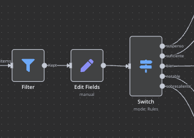

# Episodio 7: Operadores Lógicos en n8n

## Contenido del episodio
- [Introducción a los operadores lógicos](#introducción-a-los-operadores-lógicos)
- [Nodos de control de flujo](#nodos-de-control-de-flujo)
  - [Nodo Filter](#nodo-filter)
  - [Nodo IF](#nodo-if)
  - [Nodo Switch](#nodo-switch)
  - [Nodo Merge](#nodo-merge)
  - [Nodo Loop Over Items](#nodo-loop-over-items)
  - [Nodo Compare Datasets](#nodo-compare-datasets)
  - [Nodo Execute Sub-workflow](#nodo-execute-sub-workflow)
  - [Nodo Stop and Error](#nodo-stop-and-error)
  - [Nodo Wait](#nodo-wait)
- [Operadores de comparación](#operadores-de-comparación)
  - [Operadores para strings](#operadores-para-strings)
  - [Operadores para números](#operadores-para-números)
  - [Operadores para booleanos](#operadores-para-booleanos)
  - [Operadores para arrays y objetos](#operadores-para-arrays-y-objetos)
- [Combinando operadores lógicos](#combinando-operadores-lógicos)
- [Desafío de la parte 7](#desafío-de-la-parte-7)

## Introducción a los operadores lógicos

Los operadores lógicos son fundamentales en cualquier plataforma de automatización, ya que permiten tomar decisiones y controlar el flujo de ejecución de los workflows. En n8n, estos operadores se implementan a través de diversos nodos que nos permiten crear flujos condicionales, filtrar datos, comparar valores y ejecutar diferentes ramas según las condiciones que definamos.

En este episodio, exploraremos los diferentes nodos de control de flujo disponibles en n8n y cómo utilizarlos para crear workflows más inteligentes y dinámicos.

## Nodos de control de flujo

### Nodo Filter

El nodo **Filter** permite filtrar elementos que cumplen con una condición específica. Es ideal para procesar solo los datos que nos interesan y descartar el resto.

**Características principales:**
- Filtra elementos de un array basándose en una condición
- Permite utilizar múltiples condiciones combinadas con operadores AND/OR
- Soporta diferentes tipos de datos y operadores de comparación
- Puede utilizar expresiones para condiciones más complejas

**Ejemplo de uso:** Filtrar clientes que viven en una ciudad específica o que han realizado compras por encima de cierto valor.

### Nodo IF

El nodo **IF** permite bifurcar el flujo de ejecución en dos caminos diferentes según se cumpla o no una condición. Es el equivalente a la estructura condicional if-else en programación.

**Características principales:**
- Evalúa una condición y dirige el flujo por una de dos ramas: "true" o "false"
- Permite utilizar expresiones complejas para la condición
- Puede combinar múltiples condiciones con operadores lógicos
- Ideal para tomar decisiones binarias en el workflow

**Ejemplo de uso:** Enviar un email diferente dependiendo de si un usuario es nuevo o existente.

### Nodo Switch

El nodo **Switch** es similar al nodo IF, pero permite múltiples caminos basados en diferentes condiciones o valores. Es equivalente a la estructura switch-case en programación.

**Características principales:**
- Evalúa una expresión y la compara con múltiples casos posibles
- Cada caso puede dirigir a una rama diferente del workflow
- Permite definir un caso por defecto para cuando ninguna condición se cumple
- Ideal para tomar decisiones con múltiples opciones

**Ejemplo de uso:** Dirigir tickets de soporte a diferentes departamentos según su categoría.

### Nodo Merge

El nodo **Merge** permite combinar datos de diferentes ramas de un workflow. Es esencial cuando tenemos flujos que se bifurcan y luego necesitan reunirse.

**Características principales:**
- Combina datos de múltiples ramas en una sola salida
- Ofrece diferentes modos de combinación (Append, Merge by Key, Multiplex)
- Puede esperar a que todas las ramas conectadas terminen antes de continuar
- Útil para reunir resultados de procesos paralelos

**Ejemplo de uso:** Combinar resultados de diferentes APIs para crear un informe unificado.

### Nodo Loop Over Items

El nodo **Loop Over Items** permite procesar elementos de un array uno por uno o en lotes. Es ideal para operaciones que deben realizarse sobre cada elemento de una colección.

**Características principales:**
- Itera sobre cada elemento de un array o sobre lotes de elementos
- Permite definir el tamaño del lote para procesamiento en paralelo
- Puede configurarse para continuar incluso si algunos elementos fallan
- Útil para operaciones que requieren límites de API o procesamiento secuencial

**Ejemplo de uso:** Procesar una lista de usuarios para actualizar sus perfiles uno por uno.

### Nodo Compare Datasets

El nodo **Compare Datasets** permite comparar dos conjuntos de datos e identificar diferencias entre ellos. Es útil para sincronización de datos o detección de cambios.

**Características principales:**
- Compara dos inputs y encuentra elementos añadidos, modificados o eliminados
- Permite definir campos clave para la comparación
- Puede generar diferentes outputs según el resultado de la comparación
- Útil para procesos de sincronización y auditoría

**Ejemplo de uso:** Comparar una lista actual de productos con una versión anterior para identificar cambios de precio.

### Nodo Execute Sub-workflow

El nodo **Execute Sub-workflow** permite ejecutar otro workflow como parte del workflow actual. Es ideal para crear workflows modulares y reutilizables.

**Características principales:**
- Llama a otro workflow de n8n como si fuera un nodo
- Puede pasar datos al sub-workflow y recibir resultados
- Permite crear workflows modulares y reutilizables
- Útil para organizar workflows complejos en componentes más pequeños

**Ejemplo de uso:** Tener un sub-workflow para el procesamiento de pagos que pueda ser llamado desde diferentes workflows.

### Nodo Stop and Error

El nodo **Stop and Error** permite detener la ejecución de un workflow y generar un error personalizado. Es útil para manejar situaciones excepcionales.

**Características principales:**
- Detiene la ejecución del workflow
- Permite definir un mensaje de error personalizado
- Puede configurarse para ejecutarse solo bajo ciertas condiciones
- Útil para validaciones y manejo de errores

**Ejemplo de uso:** Detener un workflow si los datos de entrada no cumplen con ciertos requisitos de validación.

### Nodo Wait

El nodo **Wait** permite pausar la ejecución de un workflow durante un tiempo determinado o hasta que se cumpla una condición. Es útil para procesos que requieren esperas o verificaciones periódicas.

**Características principales:**
- Puede esperar un tiempo fijo (horas, minutos, segundos)
- Puede esperar hasta una fecha y hora específicas
- Permite configurar reintentos y verificaciones periódicas
- Útil para procesos que requieren esperas o polling

**Ejemplo de uso:** Esperar 5 minutos después de enviar un email antes de continuar con el siguiente paso.

## Operadores de comparación

Los nodos de control de flujo utilizan operadores de comparación para evaluar condiciones. Estos operadores varían según el tipo de dato que estemos comparando.

### Operadores para strings

- **is equal to**: Compara si dos strings son exactamente iguales
- **is not equal to**: Compara si dos strings son diferentes
- **contains**: Verifica si un string contiene otro
- **does not contain**: Verifica si un string no contiene otro
- **starts with**: Verifica si un string comienza con otro
- **does not start with**: Verifica si un string no comienza con otro
- **ends with**: Verifica si un string termina con otro
- **does not end with**: Verifica si un string no termina con otro
- **matches regex**: Verifica si un string coincide con una expresión regular
- **does not match regex**: Verifica si un string no coincide con una expresión regular
- **is empty**: Verifica si un string está vacío
- **is not empty**: Verifica si un string no está vacío

### Operadores para números

- **equal**: Compara si dos números son iguales
- **not equal**: Compara si dos números son diferentes
- **larger**: Verifica si un número es mayor que otro
- **larger or equal**: Verifica si un número es mayor o igual que otro
- **smaller**: Verifica si un número es menor que otro
- **smaller or equal**: Verifica si un número es menor o igual que otro
- **is empty**: Verifica si un valor numérico está vacío

### Operadores para booleanos

- **equal**: Compara si dos valores booleanos son iguales
- **not equal**: Compara si dos valores booleanos son diferentes
- **is empty**: Verifica si un valor booleano está vacío

### Operadores para arrays y objetos

- **exists**: Verifica si una propiedad existe
- **does not exist**: Verifica si una propiedad no existe
- **is empty**: Verifica si un array u objeto está vacío
- **is not empty**: Verifica si un array u objeto no está vacío
- **contains**: Verifica si un array contiene un valor específico
- **does not contain**: Verifica si un array no contiene un valor específico

## Combinando operadores lógicos

Los operadores lógicos pueden combinarse para crear condiciones más complejas:

- **AND**: Todas las condiciones deben cumplirse
- **OR**: Al menos una condición debe cumplirse

Estos operadores permiten crear lógica de negocio sofisticada en tus workflows.

## Desafío de la parte 7

Para poner en práctica lo aprendido sobre operadores lógicos, te proponemos el siguiente desafío:

Crea un workflow que procese un archivo CSV con notas de estudiantes y los clasifique en diferentes categorías según su calificación. Además, deberás identificar los tres mejores estudiantes y los tres con peores calificaciones.

Consulta el [desafío completo aquí](desafio-episodio-7.md) 