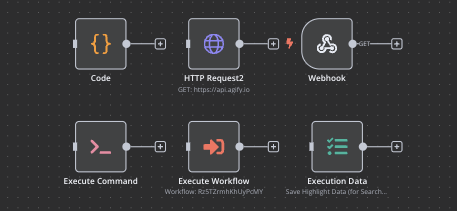
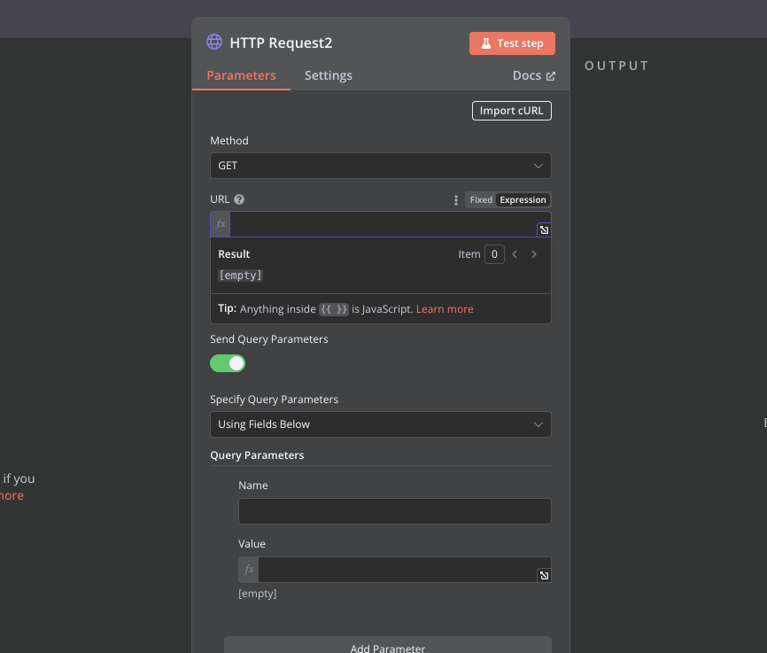

# Episodio 8: Nodos Core en n8n

## Contenido del episodio
- [Introducción a los nodos core](#introducción-a-los-nodos-core)
  - [Nodos de operaciones](#nodos-de-operaciones)
- [El nodo HTTP Request en detalle](#el-nodo-http-request-en-detalle)
  - [Configuración básica](#configuración-básica)
  - [Métodos HTTP](#métodos-http)
  - [Parámetros y headers](#parámetros-y-headers)
  - [Autenticación](#autenticación)
  - [Manejo de respuestas](#manejo-de-respuestas)
- [Ejemplos prácticos con HTTP Request](#ejemplos-prácticos-con-http-request)
  - [Consulta a una API pública](#consulta-a-una-api-pública)
  - [Envío de datos a una API](#envío-de-datos-a-una-api)
- [Otros nodos core importantes](#otros-nodos-core-importantes)
  - [Nodo Code](#nodo-code)
  - [Nodo Webhook](#nodo-webhook)
  - [Nodo Execute Command](#nodo-execute-command)
  - [Nodo n8n](#nodo-n8n)
- [Desafío de la parte 8](#desafío-de-la-parte-8)

## Introducción a los nodos core

Los nodos core son los componentes fundamentales de n8n que proporcionan funcionalidades básicas pero esenciales para crear workflows. A diferencia de los nodos de integración que se conectan con servicios específicos, los nodos core son herramientas genéricas que pueden utilizarse en prácticamente cualquier workflow.

Estos nodos son la columna vertebral de n8n y permiten realizar operaciones como iniciar workflows, hacer peticiones HTTP, ejecutar código personalizado, manipular datos y controlar el flujo de ejecución.



### Nodos de operaciones

Estos nodos realizan operaciones específicas dentro del workflow.

- **HTTP Request**: Realiza peticiones HTTP a APIs o servicios web.
- **Code**: Ejecuta código JavaScript o Python personalizado.
- **Execute Command**: Ejecuta comandos en el sistema operativo donde se aloja n8n.
- **FTP**: Transfiere archivos mediante FTP o SFTP.


## El nodo HTTP Request en detalle

El nodo **HTTP Request** es uno de los más versátiles y utilizados en n8n. Permite conectarse con cualquier API o servicio web que ofrezca una interfaz HTTP, lo que abre un mundo de posibilidades para integrar n8n con prácticamente cualquier servicio online.



### Configuración básica

Para configurar un nodo HTTP Request, necesitamos definir:

1. **Método HTTP**: GET, POST, PUT, DELETE, etc.
2. **URL**: La dirección del recurso al que queremos acceder.
3. **Autenticación**: Si la API requiere autenticación, podemos configurarla aquí.
4. **Parámetros de consulta**: Parámetros que se añadirán a la URL.
5. **Headers**: Cabeceras HTTP para la petición.
6. **Body**: Datos que se enviarán en el cuerpo de la petición (para POST, PUT, etc.).

### Métodos HTTP

Los métodos HTTP más comunes son:

- **GET**: Solicita datos de un recurso específico. No modifica datos en el servidor.
- **POST**: Envía datos para crear un nuevo recurso.
- **PUT**: Actualiza un recurso existente.
- **DELETE**: Elimina un recurso específico.
- **PATCH**: Actualiza parcialmente un recurso existente.
- **HEAD**: Similar a GET pero solo solicita las cabeceras, no el cuerpo de la respuesta.
- **OPTIONS**: Solicita información sobre las opciones de comunicación disponibles.

### Parámetros y headers

- **Parámetros de consulta**: Se añaden a la URL después del signo de interrogación (`?`). Por ejemplo: `https://api.ejemplo.com/usuarios?id=123&activo=true`.
- **Headers**: Proporcionan información adicional sobre la petición o el cliente. Comunes:
  - `Content-Type`: Indica el formato de los datos enviados (ej. `application/json`).
  - `Authorization`: Proporciona credenciales para autenticación.
  - `Accept`: Indica qué tipos de contenido puede procesar el cliente.

### Autenticación

n8n soporta varios métodos de autenticación:

- **Basic Auth**: Usuario y contraseña codificados en Base64.
- **Bearer Token**: Un token de acceso que se envía en el header `Authorization`.
- **Digest Auth**: Similar a Basic Auth pero más seguro.
- **OAuth 1.0**: Protocolo de autorización para APIs.
- **OAuth 2.0**: Versión mejorada de OAuth 1.0, ampliamente utilizada.
- **API Key**: Una clave única que identifica al cliente.

### Manejo de respuestas

Después de realizar una petición HTTP, el nodo proporciona:

- **Status Code**: Código de estado HTTP (200 OK, 404 Not Found, etc.).
- **Headers**: Cabeceras de la respuesta.
- **Body**: Cuerpo de la respuesta, que puede ser JSON, XML, HTML, etc.

n8n intenta automáticamente parsear respuestas JSON, lo que facilita el acceso a los datos en nodos posteriores.

## Ejemplos prácticos con HTTP Request

### Consulta a una API pública

Vamos a ver cómo consultar la API pública de OpenWeatherMap para obtener el clima actual:

1. **Configuración del nodo HTTP Request**:
   - Método: `GET`
   - URL: `https://api.openweathermap.org/data/2.5/weather`
   - Parámetros:
     - `q`: `Madrid,es` (ciudad)
     - `appid`: `tu_api_key` (clave de API)
     - `units`: `metric` (para obtener temperaturas en Celsius)

2. **Resultado**:
   ```json
   {
     "weather": [
       {
         "main": "Clear",
         "description": "cielo claro"
       }
     ],
     "main": {
       "temp": 22.5,
       "feels_like": 21.8,
       "humidity": 45
     },
     "name": "Madrid"
   }
   ```

### Envío de datos a una API

Ahora veamos cómo enviar datos a una API para crear un nuevo recurso:

1. **Configuración del nodo HTTP Request**:
   - Método: `POST`
   - URL: `https://api.ejemplo.com/usuarios`
   - Headers:
     - `Content-Type`: `application/json`
   - Body (en modo JSON):
     ```json
     {
       "nombre": "Ana",
       "email": "ana@ejemplo.com",
       "rol": "administrador"
     }
     ```

2. **Resultado** (respuesta de la API):
   ```json
   {
     "id": 123,
     "nombre": "Ana",
     "email": "ana@ejemplo.com",
     "rol": "administrador",
     "creado": "2023-06-15T10:30:00Z"
   }
   ```

## Otros nodos core importantes

### Nodo Code

El nodo **Code** permite ejecutar código JavaScript o Python personalizado, lo que ofrece una flexibilidad enorme para manipular datos o implementar lógica compleja.

**Ejemplo (JavaScript):**
```javascript
// Datos de entrada: array de números
// Objetivo: calcular estadísticas básicas
const numeros = items[0].json.numeros;
const suma = numeros.reduce((a, b) => a + b, 0);
const promedio = suma / numeros.length;
const min = Math.min(...numeros);
const max = Math.max(...numeros);

// Devolver resultados
return [
  {
    json: {
      suma,
      promedio,
      min,
      max,
      cantidad: numeros.length
    }
  }
];
```

### Nodo Webhook

El nodo **Webhook** crea un endpoint HTTP que puede recibir peticiones externas para iniciar el workflow. Es ideal para integraciones con servicios que soportan webhooks.

**Características principales:**
- Genera una URL única
- Puede configurarse para aceptar diferentes métodos HTTP
- Puede procesar diferentes formatos de datos (JSON, form-data, etc.)
- Permite responder con datos personalizados

### Nodo Execute Command

El nodo **Execute Command** ejecuta comandos en el sistema operativo donde se aloja n8n. Es útil para tareas como manipulación de archivos, ejecución de scripts o interacción con herramientas del sistema.

**Ejemplo:**
```
ls -la /ruta/a/directorio
```

**Nota de seguridad:** Este nodo debe usarse con precaución, ya que ejecuta comandos con los mismos permisos que el proceso de n8n.

### Nodo n8n

El nodo **n8n** permite interactuar con la propia instancia de n8n, realizando operaciones como:
- Obtener información sobre workflows
- Activar o desactivar workflows
- Ejecutar workflows
- Gestionar credenciales

Es útil para crear meta-workflows que administren otros workflows.

## Desafío de la parte 8

Para poner en práctica lo aprendido sobre nodos core, especialmente el HTTP Request, te proponemos el siguiente desafío:

Crea un workflow que utilice la API de Agify para predecir la edad basada en un nombre, y luego compare esa predicción con la edad real de la persona.

Consulta el [desafío completo aquí](desafio-episodio-8.md) 